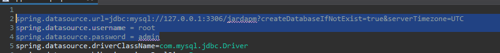

# Jarda Project Manager Api.

Essa Api foi desenvolvida como parte de um projeto 
simples onde você pode cadastrar um projeto, atividades para o mesmo estipulando datas de entrega e se o projeto está dentro/fora do prazo de entrega.

---
## Conteúdos

 <a href="#pré-requisitos">Pré requisitos</a> 
 <a href="#como-rodar">Como rodar</a> 
 <a href="#tecnologias">Tecnologias</a> 

<h4 align="center"> 
 ⚠️Projeto em andamento⚠️
</h4>

## Pré requisitos

Este repositório contém apenas o back-end da aplicação que foi feita usando Java e Spring-Boot então você vai precisar de algumas ferramentas pré instaladas para rodar o projeto.

- Instalar a JDK 11 em sua máquina;
- Alguma IDE de sua preferência que dê suporte a Java ( eu uso o Eclipse mas pode ser uma de sua preferência, VS-code ou IntelliJ por exemplo);
- Ter um gerenciador de banco de dados instalado (Dbeaver, HeidiSQL, SequelPro etc);
- Ter um servidor de banco de dados MySQL rodando local para conexão com banco de dados;

Caso você use o Eclipse, vai ser necessárioa a adição de um plugin chamado Lombok nele (tutorial nesse link https://projectlombok.org/setup/eclipse) . 
Ele é usado para o próprio Lombok ser reconhecido dentro da IDE. 

A versão do Eclipse que eu recomendo é a "Enterprise for Java Developers" que eu acho a mais completa.

Ah você deve estar se perguntando "tá, mas o que é lombok?", o lombok se trata de uma ferramenta com o objetivo de eliminação de código boilerplate, os famosos getters
e settes do Java são um belo exemplo de coisas que são praticamente deletadas do projeto com a sua utilização.

---

## Como rodar

Aqui a gente chega em um "problema" pois vai variar muito de acordo da forma que você deseja rodar, seja para alterar o código de fato ou apenas disponibilizar a aplicação
localmente para ser consumida.

A primeira coisa que voce deve fazer é acessar o arquivo "application.properties" em src/main/resources e alterar as credenciais de acesso ao banco de dados.

A Aplicação vai criar o banco pra você, então não esquenta a cabeça.

<h1 align="center">
    
</h1>

<h2>Aqui vão algumas formas de rodar a aplicação, caso você deseja alterar o código:</h2>

- Por alguma IDE, você vai precisar ver como fazer em cada uma. Isso aqui serviria mais caso você deseje alterar o código.

No caso do eclipse é só abrir a IDE, acessar o menu File/Import... selecionar a opção "Maven" e depois "Existing Maven Projects" e importar. 

Você consegue acompanhar vendo a barra de progresso pelo lado inferior direito, após finalizar tudo ( A primeira vez pode demorar um pouco,
podemos considerar o Maven como se fosse o "node" de um projeto React/Angular, ele que vai gerenciar as dependências então vai ser necessário espear ele fazer os downloads).

Após isso você pode rodar ele abrindo o package com.jardapm dando um click com o mouse 2 sobre a classe principal "JardaPmApiApplication" 
e selecionar Debug/Run as Java Application.

O processo parece complicado, mas é tranquilo 😄 

<h2>Caso você queira apenas disponibilizar localmente:</h2>

- Caso você precise só rodar a aplicação pra consumir, você pode simplesmente gerar o jar da aplicação com o mvn e executar ele;
- Você pode dar uma pesquisada de como rodar a aplicação via linha de comando;
- E caso tenha conhecimento sobre docker, creio que seja a opção mais interessante para não ter que instalar vários pacotes.

---

### Tecnologias

- [Java](https://www.java.com/pt-BR/)
- [Ecossistema Spring](https://spring.io/)

